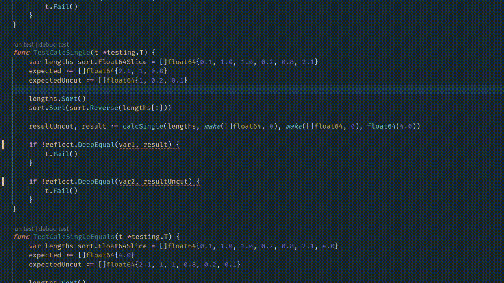

# AltCopy - Multiple Clipboards. 
Life made simple, one clipboard at a time.

## What it does
- Copy to an alternative clipboard
- Paste from an alternative clipboard
- Maintain default copy/paste functionality

## How to use
#### Keybindings
- `Ctrl + Alt + c` = Copy to register
- `Ctrl + Alt + v` = Paste from register

#### Usage
You can freely change between using `Ctrl C / V` and `Ctrl Alt C / V` to your wishes, the "Alt" clipboard is stored in a register within the hotkey.

## Future idea's
- `Ctrl + Alt + x` = Cut to register and paste what is currently in clipboard. (#1)

## How to install
- Install AutoHotkey (https://www.autohotkey.com/)
- Copy `AltCopy.ahk` into your startup folder (Open run dialog -> `shell:startup`)
- Double-click the `AltCopy.ahk` file if you do not wish to restart immediately.
- Enjoy!

## Customization
#### If you rather use `Ctrl + Shift + c`
- Open the script in a text editor
- Change `^!C::` and `^!V::` to `^+V::` `^+V::`
- Save and reload hotkey